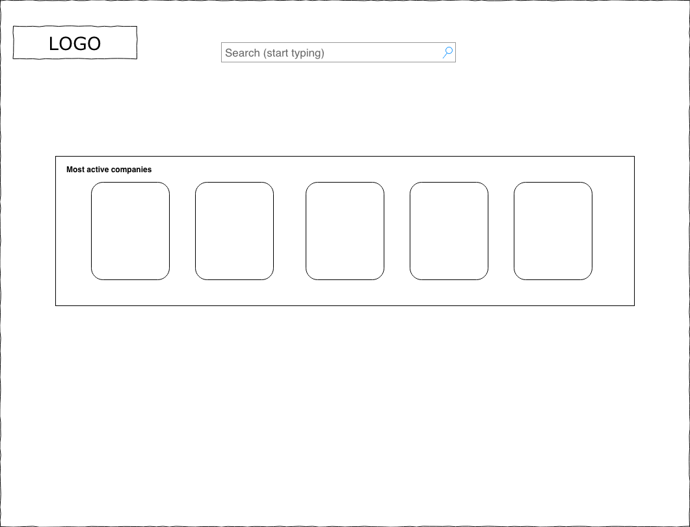
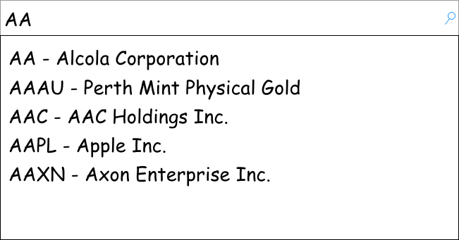
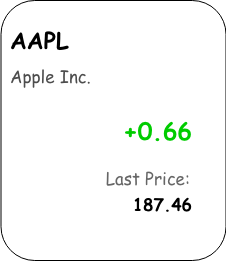
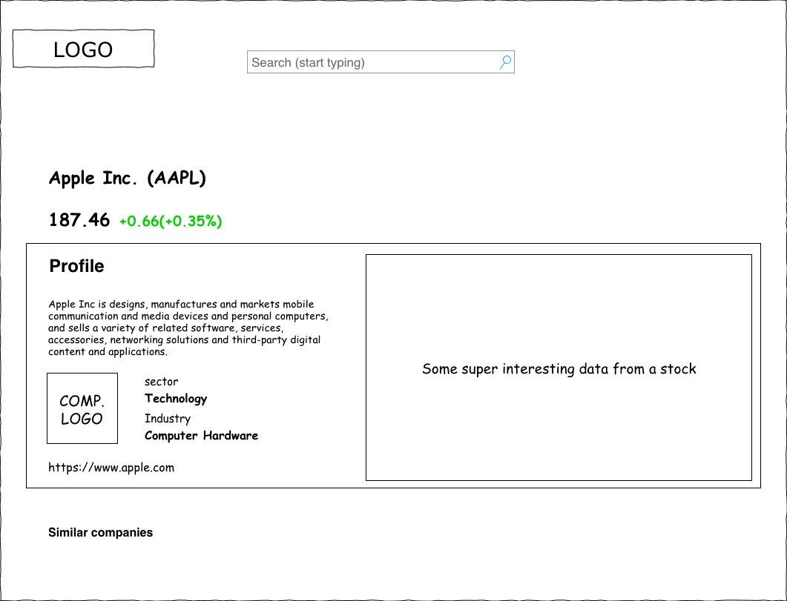

# Hiring event

## Stock app

You gonna build a SPA application (using Angular framework) which will communicate with open IEX Trading API and help user get some data about companies.

### Requirments
- should use Angular framework (currently it's version 7)
- data should be gathered from [`IEX Trading API`](https://iextrading.com/developer/docs/)
- all requests and async actions should be done via RxJS
- for navigation between pages use `@angular/router` (or any prefered)
- every async iteraction with a API should be show user a loading spinner
- you free to use any styling framework
- app should be responsive with at least 3 media break points
- tests are optional (but is plus)

### Workflows

#### 1. Landing page
- User should be able to see search input with a placeholder
- Bellow search input should be a section of gainer companies. Data could be fetched [from this end point](https://api.iextrading.com/1.0/stock/market/list/gainers)

Basic mockup:  

#### 1.1 Search input

- User should be able to type [company ticker symbol](https://en.wikipedia.org/wiki/Ticker_symbol) like (AAPL, GOOG)
- Search component should show suggentions (like autocomplete in google). A list of avalible symbols could be [fetched from this API](https://api.iextrading.com/1.0/ref-data/symbols)
- user could choose a suggested company from a list (via keyboard or mouse)
- user should be navigated to a company page if it were choosen

Basic mockup:  

#### 1.2 Company card

- User should be able to see a:
  - `symbol`
  - `company name`
  - `price change`
  - `last price`

Basic mockup:  

#### 2. Company page

- use `company/{symbol}` route for this page
- user should be able to see company info on a page
- data sources:
  - company logo [API docs](https://iextrading.com/developer/docs/#logo)
  - company info [API docs](https://iextrading.com/developer/docs/#company)
  - company quote info [API docs](https://iextrading.com/developer/docs/#quote)

Basic mockup:  
