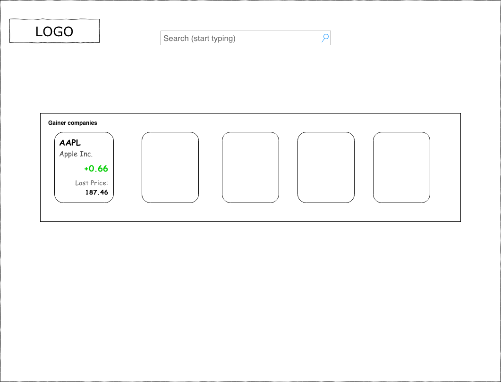

# Hiring event 🎉

## Table of Contents

* [Application](#stock-app)
  * [Requirements](#requirements)
  * [Workflows](#workflows)
    * [Landing page](#1-landing-page)
    * [Search input](#11-search-input)
    * [Company card](#12-company-card)
    * [Company page](#2-company-page)
  * [Evaluation](#evaluation)
* [Where to get a data?](#where-to-get-a-data)
* [Browser Support](#browser-support)
* [FAQ](#faq)
* [Useful scripts](#useful-scripts)

## Stock app

You gonna build a SPA application (using Angular framework) which will communicate with open IEX Trading API and help user get some data about companies.

### Requirements

* should use Angular framework (currently it's version 7) with [@angular/cli](https://cli.angular.io/)
* data should be gathered from [`IEX Trading API`](https://iextrading.com/developer/docs/)
* all requests and async actions should be done via RxJS
* for navigation between pages use `@angular/router` (or any preferred)
* every async interaction with a API should be show user a loading spinner
* you free to use any styling framework
* app should be responsive with at least 3 media break points
* tests are optional (but is plus)
* default commands from [@angular/cli](https://cli.angular.io/) should not be modified, as them will be used for project evaluation.

### Workflows

#### 1. Landing page

* User should be able to see search input with a placeholder
* Bellow search input should be a section of gainer companies.

Basic mockup:  


#### 1.1 Search input

* User should be able to type [company ticker symbol](https://en.wikipedia.org/wiki/Ticker_symbol) like (AAPL, GOOG)
* Search component should show suggestions (like a google autocomplete).
* user could choose a suggested company from a list (via keyboard or mouse)
* user should be navigated to a company page if it were chosen

Basic mockup:  


#### 1.2 Company card

User should be able to see a:

* `symbol`
* `company name`
* `price change`
* `last price`

Basic mockup:  


#### 2. Company page

* use `company/{symbol}` route for this page
* user should be able to see detailed company description with a logo
* and of course detailed financial info 😉

Basic mockup:  


### Evaluation

| Story         | Task         | Points | Criteria                                                                                                                |
|---------------|--------------|--------|-------------------------------------------------------------------------------------------------------------------------|
| Global layout |              |        |                                                                                                                         |
|               | Logo         | 5      | Click will redirect to Landing page                                                                                     |
|               | Search bar   | 25     | 10 points for basic submit and redirect to company page.                                                                |
|               |              |        | 25 points for autosuggest component which show relevant TOP 5                                                           |
|               |              |        |                                                                                                                         |
| Landing page  |              |        |                                                                                                                         |
|               | Responsive   | 5      | Support desktop (1920p) and mobile (360p) breakpoints                                                                   |
|               | Company list | 30     | 20 show list of companies + 10 support click with routing to company page                                               |
|               |              |        |                                                                                                                         |
| Company page  |              |        |                                                                                                                         |
|               | Responsive   | 5      | Support desktop (1920p) and mobile (360p) breakpoints                                                                   |
|               | Company info | 30     | Show all of the fields as on mockup                                                                                     |
|               |              |        |                                                                                                                         |
|               | Total:       | 100    |                                                                                                                         |

### Where to get a data?

This is list of endpoints which You have to use:

* GET all companies symbols `https://api.iextrading.com/1.0/ref-data/symbols`. Example response:

```json
[
    {
        "symbol":"AAPL",
        "name":"Apple Inc.",
        "date":"2018-11-23",
        "isEnabled":true,
        "type":"cs",
        "iexId":"11"
    } // , { ... }
]
```

* GET all gainers `https://api.iextrading.com/1.0/stock/market/list/gainers` [Link to documentation](https://iextrading.com/developer/docs/#list). Example response:

```json
[
  {
      "symbol": "AAPL",
      "companyName": "Apple Inc.",
      "primaryExchange": "Nasdaq Global Select",
      "sector": "Technology",
      "calculationPrice": "tops",
      "latestPrice": 158.73,
      "latestSource": "Previous close",
      "latestTime": "September 19, 2017",
      "latestUpdate": 1505779200000,
      "latestVolume": 20567140,
      "iexRealtimePrice": 158.71,
      "iexRealtimeSize": 100,
      "iexLastUpdated": 1505851198059,
      "delayedPrice": 158.71,
      "delayedPriceTime": 1505854782437,
      "previousClose": 158.73,
      "change": -1.67,
      "changePercent": -0.01158,
      "iexMarketPercent": 0.00948,
      "iexVolume": 82451,
      "avgTotalVolume": 29623234,
      "iexBidPrice": 153.01,
      "iexBidSize": 100,
      "iexAskPrice": 158.66,
      "iexAskSize": 100,
      "marketCap": 751627174400,
      "peRatio": 16.86,
      "week52High": 159.65,
      "week52Low": 93.63,
      "ytdChange": 0.3665,
  } // , { ... }
]
```

* Get company basic description `https://api.iextrading.com/1.0/stock/${symbol}/company` [Link to documentation](https://iextrading.com/developer/docs/#company). Example response:

```json
{
  "symbol": "AAPL",
  "companyName": "Apple Inc.",
  "exchange": "Nasdaq Global Select",
  "industry": "Computer Hardware",
  "website": "http://www.apple.com",
  "description": "Apple Inc is an American multinational technology company. It designs, manufactures, and markets mobile communication and media devices, personal computers, and portable digital music players.",
  "CEO": "Timothy D. Cook",
  "issueType": "cs",
  "sector": "Technology",
  "tags": [
      "Technology",
      "Consumer Electronics",
      "Computer Hardware"
  ]
}
```

* Get company logo `https://api.iextrading.com/1.0/stock/${symbol}/logo` [Link to documentation](https://iextrading.com/developer/docs/#logo). Example response:

```json
{
  "url": "https://storage.googleapis.com/iex/api/logos/AAPL.png"
}
```

* Get company specific quote `https://api.iextrading.com/1.0/stock/${symbol}/quote` [Link to documentation](https://iextrading.com/developer/docs/#quote). Example response:

```json
{
  "symbol": "AAPL",
  "companyName": "Apple Inc.",
  "primaryExchange": "Nasdaq Global Select",
  "sector": "Technology",
  "calculationPrice": "tops",
  "open": 154,
  "openTime": 1506605400394,
  "close": 153.28,
  "closeTime": 1506605400394,
  "high": 154.80,
  "low": 153.25,
  "latestPrice": 158.73,
  "latestSource": "Previous close",
  "latestTime": "September 19, 2017",
  "latestUpdate": 1505779200000,
  "latestVolume": 20567140,
  "iexRealtimePrice": 158.71,
  "iexRealtimeSize": 100,
  "iexLastUpdated": 1505851198059,
  "delayedPrice": 158.71,
  "delayedPriceTime": 1505854782437,
  "extendedPrice": 159.21,
  "extendedChange": -1.68,
  "extendedChangePercent": -0.0125,
  "extendedPriceTime": 1527082200361,
  "previousClose": 158.73,
  "change": -1.67,
  "changePercent": -0.01158,
  "iexMarketPercent": 0.00948,
  "iexVolume": 82451,
  "avgTotalVolume": 29623234,
  "iexBidPrice": 153.01,
  "iexBidSize": 100,
  "iexAskPrice": 158.66,
  "iexAskSize": 100,
  "marketCap": 751627174400,
  "peRatio": 16.86,
  "week52High": 159.65,
  "week52Low": 93.63,
  "ytdChange": 0.3665,
}
```

### Browser Support

Any browser of your choice. Hope it would be Chrome 😂

### FAQ

### Useful scripts
Useful scripts from [@angular/cli](https://cli.angular.io/)  could be useful for current task implementation.
 
 To generate an Angular project via a development server:
```js
ng new stocks-app
```
To start project
```js
ng serve
```
To run project tests
```js
ng test
```
To run linter
```js
ng lint
```
To generate component
```js
ng generate component [name]
```
To generate service
```js
ng generate service [name]
```
Other usefull scripts from [@angular/cli](https://cli.angular.io/) can be found [here](hhttps://angular.io/cli).
